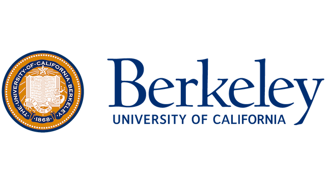
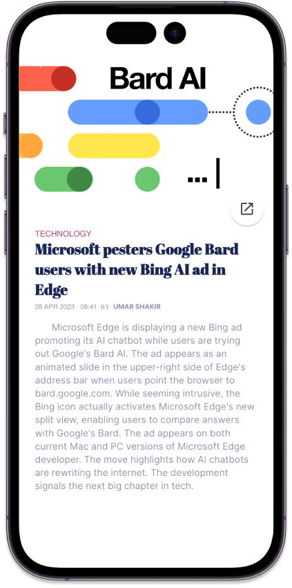
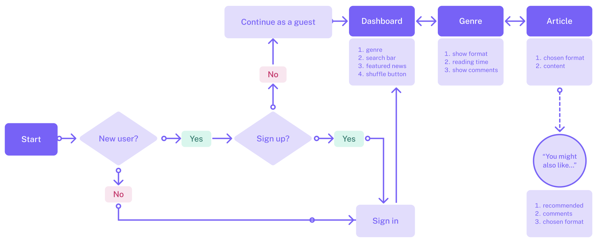
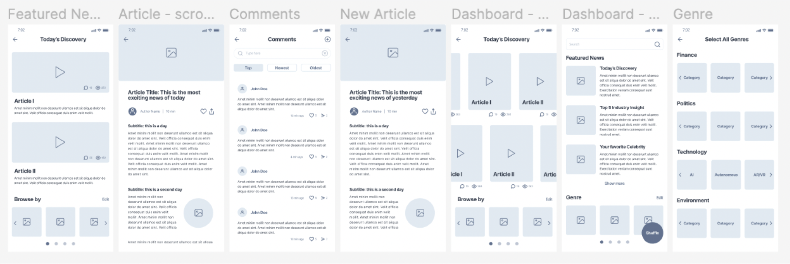
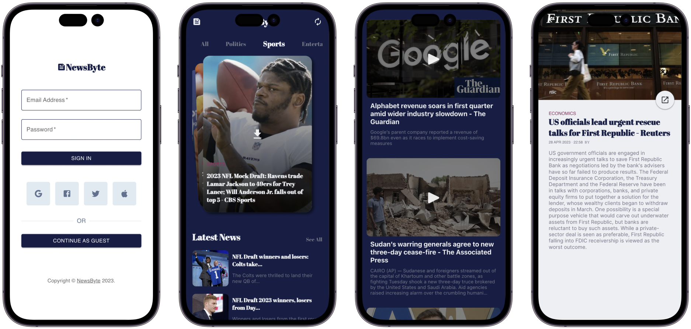

[](https://app.netlify.com/sites/newsbyte-mobile/deploys)
# NewsByte Mobile

## TEAM
- Du Xiang
- Ye Moon Cho
- Winny Wang
- Amrita Moturi
- Samriddho Ghosh



## NewsByte App

You can visit the app [here](https://newsbyte-mobile.netlify.app/).

<p float="left">
  
  
</p>


## Repository Structure

```bash
README.md
netlify.toml
package-lock.json
package.json
public
   |-- My project.png
   |-- favicon.ico
   |-- index.html
   |-- logo192.png
   |-- logo512.png
   |-- manifest.json
   |-- robots.txt
src
   |-- App.css
   |-- App.js
   |-- assets
   |   |-- business.png
   |   |-- economics.png
   |   |-- environment.png
   |   |-- politics.png
   |   |-- technology.png
   |   |-- world.png
   |-- components
   |   |-- article.js
   |   |-- articleDash.js
   |   |-- genreNavbar.js
   |   |-- menubar.js
   |   |-- sliderAudio.js
   |   |-- styles
   |   |   |-- article.css
   |   |   |-- articleDash.css
   |   |   |-- genreNavbar.css
   |   |   |-- menubar.css
   |-- index.css
   |-- index.js
   |-- news
   |   |-- news.js
   |-- screens
   |   |-- ArticleDetails.js
   |   |-- Articles.js
   |   |-- Dashboard.js
   |   |-- SignIn.js
   |-- services
   |   |-- newsApiService.js
   |   |-- textToSpeech.js
   |-- styles
   |   |-- SignIn.css
   |   |-- SocialSignInButtons.css
   |   |-- articleDetails.css
   |   |-- articles.css
   |   |-- dashboard.css
```


## Problem

In today's fast-paced and information-rich world, individuals often struggle to keep up with the news and stay informed about the latest events and trends. With the overwhelming amount of information available online, it can be challenging to find reliable sources and filter out uninteresting, fake news and biased content. It can also be challenging to consume news in a limited time span. This calls for a streamlined news consumption platform, designed for busy individuals with tight schedules.

## Target User Group

Our target users are busy individuals who don’t have enough time to read and consumer news, and hope to get quick summaries with their mobile devices.


## Solution

We developed a smart news curation app that can provide personalized, accurate, and timely news updates to users based on their interests and preferences. This app would leverage the power of AI algorithms and natural language processing techniques to analyze and categorize news articles from various sources, identify patterns, and deliver relevant content to users in a user-friendly and easy-to-digest format. Specifically, the app will utilize the benefits of different types of format (text, image, audio, etc) to meet the users’ needs. The app would not only help users save time and effort in finding and reading news but also ensure that they stay informed and aware of the world around them.




## Design Evolution

We strategized our approach to the task flows and determined which tasks required immediate attention and establish a clear, holistic view of the overall task flows. Following this crucial planning phase, we transitioned to Figma to meticulously develop low-fidelity user interfaces for each task. This streamlined, two-step workflow facilitated seamless communication and collaboration among team members, ultimately resulting in efficient and well-orchestrated design development that effectively addressed project requirements.



## Final Prototype - NewsByte

NewsByte leverages advanced technologies to deliver concise and timely news updates in a user-friendly manner.

- **Audio Feature**: The app incorporates a state-of-the-art text-to-speech API, which enables it to provide the latest news in an easy-to-consume audio format. This feature is perfect for users on the go, enabling them to stay informed without needing to visually engage with their device.
- **News Summarization**: In order to keep the news brief and digestible, NewsByte utilizes the power of the GPT-3.5 API. This advanced language model is used to accurately summarize news content, ensuring users receive the most important information without any unnecessary fluff.
- **News Content**: At the heart of NewsByte is its ability to fetch up-to-date news from a variety of sources, made possible through integration with the NewsAPI. In addition, the app employs sophisticated HTML scraping techniques to obtain full text news articles, ensuring users have access to a wide range of content in a format that suits their needs.

The combination of these technologies results in a seamless and efficient news consumption experience, perfect for busy individuals who value staying informed.


